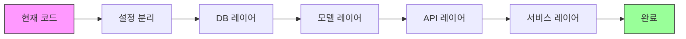

# WCMS 리팩토링 계획

> **작성일**: 2025-12-30  
> **버전**: 1.0  
> **상태**: 진행 중

---

## 📋 목차

1. [개요](#개요)
2. [리팩토링 목표](#리팩토링-목표)
3. [현재 문제점](#현재-문제점)
4. [리팩토링 단계](#리팩토링-단계)
5. [마이그레이션 전략](#마이그레이션-전략)
6. [체크리스트](#체크리스트)

---

## 개요

WCMS 프로젝트가 95% 완성 단계에 도달하여, 코드 품질 개선과 유지보수성 향상을 위한 체계적인 리팩토링을 진행합니다.

### 현재 상태
- **서버**: 1270줄의 단일 파일 (`server/app.py`)
- **클라이언트**: 기본 구조는 양호하나 개선 여지 있음
- **문서**: 분산되고 중복된 문서 구조
- **테스트**: 통합 테스트 위주, 단위 테스트 부족

### 목표 상태
- **서버**: 모듈화된 아키텍처 (MVC 패턴)
- **클라이언트**: 설정 중앙화, 에러 핸들링 강화
- **문서**: 체계적이고 명확한 문서 구조
- **테스트**: 단위/통합 테스트 완비

---

## 리팩토링 목표

### 1. 코드 품질
- 단일 책임 원칙 (SRP) 준수
- DRY (Don't Repeat Yourself) 원칙 적용
- 명확한 모듈 경계 설정
- 타입 힌팅 추가

### 2. 유지보수성
- 코드 가독성 향상
- 명확한 에러 메시지
- 로깅 체계 개선
- 설정 관리 중앙화

### 3. 확장성
- 새 기능 추가 용이성
- API 버전 관리
- 플러그인 구조 고려
- 마이크로서비스 전환 가능성

### 4. 테스트 가능성
- 단위 테스트 작성 용이
- 의존성 주입
- 모킹 가능한 구조
- CI/CD 통합

---

## 현재 문제점

### 서버 (`server/app.py`)

#### 1. 단일 파일 비대화 (1270줄)
```python
# 현재: 모든 기능이 app.py에 집중
- 데이터베이스 헬퍼 (18줄~)
- 웹 라우트 (169줄~)
- 클라이언트 API (532줄~)
- 관리자 API (389줄~)
- 백그라운드 작업 (117줄~)
```

**문제점:**
- 기능 위치 파악 어려움
- 코드 충돌 위험 증가
- 테스트 작성 어려움

#### 2. 의존성 혼재
```python
# 현재: 데이터베이스 로직이 라우트에 직접 포함
@app.route('/api/pcs')
def api_pcs():
    db = get_db()
    pcs = db.execute('SELECT * FROM pc_info').fetchall()
    # ... 비즈니스 로직 ...
```

**문제점:**
- 테스트 시 실제 DB 필요
- 로직 재사용 불가
- 비즈니스 로직과 라우팅 혼재

#### 3. 설정 하드코딩
```python
# 현재: 설정이 코드 곳곳에 분산
app.secret_key = 'woosuk25'
DB_PATH = os.path.join(os.path.dirname(__file__), 'db.sqlite3')
```

**문제점:**
- 환경별 설정 변경 어려움
- 보안 정보 노출 위험
- 테스트 설정 분리 불가

### 클라이언트

#### 1. 설정 분산
```python
# main.py
SERVER_URL = "http://aps.or.kr:8057/"

# collector.py
WINDOWS_SYSTEM_PROCESSES = { ... 100+ 항목 ... }
```

**문제점:**
- 설정 변경 시 여러 파일 수정 필요
- 환경별 설정 관리 어려움

#### 2. 에러 핸들링 불충분
```python
# executor.py
try:
    subprocess.run(command, ...)
except Exception as e:
    return f"실행 실패: {str(e)}"  # 너무 일반적
```

**문제점:**
- 에러 원인 파악 어려움
- 로깅 불충분
- 재시도 로직 없음

### 문서

#### 1. 문서 분산
```
- README.md (287줄)
- GUIDE.md (747줄)
- STATUS.md (242줄)
- BACKGROUND_CHECKER.md (빈 파일)
- LONGPOLLING_OPTIMIZATION.md
- archive/docs/ (7개 문서)
```

**문제점:**
- 정보 중복
- 일관성 부족
- 최신성 유지 어려움

---

## 리팩토링 단계

### Phase 1: 서버 모듈화 (1주)

#### 1.1 디렉토리 구조 생성
```
server/
├── app.py                 # 앱 초기화 및 실행
├── config.py              # 설정 관리
├── models/                # 데이터 모델
│   ├── __init__.py
│   ├── pc.py             # PC 관련 모델
│   ├── command.py        # 명령 모델
│   └── admin.py          # 관리자 모델
├── api/                   # API 엔드포인트
│   ├── __init__.py
│   ├── client.py         # 클라이언트 API
│   ├── admin.py          # 관리자 API
│   └── web.py            # 웹 페이지 라우트
├── utils/                 # 유틸리티
│   ├── __init__.py
│   ├── database.py       # DB 헬퍼
│   ├── auth.py           # 인증 데코레이터
│   └── validators.py     # 검증 함수
└── services/              # 비즈니스 로직
    ├── __init__.py
    ├── pc_service.py     # PC 관리 서비스
    └── command_service.py # 명령 처리 서비스
```

#### 1.2 코드 이동 순서
1. **설정 분리** (`config.py`)
   - 환경 변수 로드
   - DB 경로, Secret key 등

2. **데이터베이스 레이어** (`utils/database.py`)
   - `get_db()`, `close_db()`, `execute_query()` 이동
   - Connection pool 구현

3. **모델 레이어** (`models/`)
   - PC, Command, Admin 모델 클래스 생성
   - SQL 쿼리 캡슐화

4. **API 레이어** (`api/`)
   - 라우트 핸들러 분리
   - Blueprint 사용

5. **서비스 레이어** (`services/`)
   - 비즈니스 로직 분리
   - 재사용 가능한 함수

#### 1.3 테스트 작성
- 각 모듈별 단위 테스트
- API 통합 테스트 유지

### Phase 2: 클라이언트 개선 (3일)

#### 2.1 구조 개선
```
client/
├── main.py               # 메인 엔트리포인트 (간소화)
├── config.py             # 설정 중앙화
├── collector.py          # 정보 수집 (개선)
├── executor.py           # 명령 실행 (개선)
├── service.py            # Windows 서비스
├── utils.py              # 재사용 함수
└── data/                 # 데이터 파일
    └── system_processes.json  # 시스템 프로세스 목록
```

#### 2.2 개선 항목
1. **설정 관리** (`config.py`)
   ```python
   # 환경변수 또는 설정 파일에서 로드
   SERVER_URL = os.getenv('WCMS_SERVER_URL', 'http://aps.or.kr:8057/')
   HEARTBEAT_INTERVAL = int(os.getenv('WCMS_HEARTBEAT_INTERVAL', '300'))
   COMMAND_POLL_INTERVAL = int(os.getenv('WCMS_POLL_INTERVAL', '10'))
   ```

2. **에러 핸들링** (`utils.py`)
   ```python
   def retry_on_network_error(func, max_retries=3, delay=5):
       """네트워크 에러 시 재시도 데코레이터"""
   ```

3. **로깅 개선**
   - 구조화된 로그 포맷
   - 로그 레벨 환경변수로 제어

### Phase 3: 문서 재편성 (2일)

#### 3.1 문서 구조
```
docs/
├── README.md              # 프로젝트 개요 (간소화)
├── GUIDE.md               # 사용자 가이드
├── ARCHITECTURE.md        # 시스템 아키텍처 (신규)
├── API.md                 # API 명세서
├── CHANGELOG.md           # 변경 이력 (STATUS.md 대체)
├── CONTRIBUTING.md        # 기여 가이드 (신규)
└── technical/             # 기술 문서
    ├── database_schema.md
    ├── longpolling.md     # LONGPOLLING_OPTIMIZATION.md 이동
    └── deployment.md
```

#### 3.2 작업 내용
1. **README.md 간소화**
   - 핵심 정보만 유지
   - 상세 내용은 다른 문서로 링크

2. **ARCHITECTURE.md 작성**
   - 시스템 구조도
   - 데이터 흐름
   - 모듈 설명

3. **CHANGELOG.md 생성**
   - STATUS.md를 변경 이력 형식으로 전환
   - Keep a Changelog 형식 준수

4. **문서 정리**
   - 빈 파일 삭제 (BACKGROUND_CHECKER.md)
   - 중복 내용 통합
   - archive/ 정리

### Phase 4: 코드 품질 도구 (1일)

#### 4.1 도구 설정 (uv 기반, 분리된 의존성)

**프로젝트 구조**:
```
WCMS/
├── pyproject.toml         # 메타 프로젝트
├── server/pyproject.toml  # 서버 의존성 (Flask, bcrypt 등)
└── client/pyproject.toml  # 클라이언트 의존성 (psutil, wmi 등)
```

**서버 의존성** (server/pyproject.toml):
```toml
[project]
dependencies = [
    "flask>=2.3.0",
    "requests>=2.32.5",
    "bcrypt>=4.0.0",
]

[project.optional-dependencies]
dev = ["black", "flake8", "pytest"]
```

**클라이언트 의존성** (client/pyproject.toml):
```toml
[project]
dependencies = [
    "requests>=2.32.5",
    "psutil>=7.1.3",
    "wmi>=1.5.1",
    "pywin32>=306",
]

[project.optional-dependencies]
dev = ["black", "flake8", "pytest"]
build = ["pyinstaller>=6.0.0"]
```

#### 4.2 의존성 관리 (각각 설치)

```bash
# 서버만 설치
cd server
uv sync
uv sync --all-extras

# 클라이언트만 설치
cd client
uv sync
uv sync --all-extras

# 전체 설치 (루트에서)
uv sync --all-extras
```

**참고**: pyproject.toml이 모든 의존성을 관리합니다. requirements.txt는 불필요합니다. 자세한 내용은 [UV_SETUP.md](UV_SETUP.md)를 참고하세요.

#### 4.3 타입 힌팅 추가
```python
# 예시: models/pc.py
from typing import Optional, Dict, List

class PCModel:
    def get_by_id(self, pc_id: int) -> Optional[Dict]:
        """PC ID로 PC 정보 조회"""
        ...
```

### Phase 5: 테스트 인프라 (3일)

#### 5.1 테스트 구조
```
tests/
├── __init__.py
├── conftest.py            # pytest 설정
├── server/
│   ├── test_models.py
│   ├── test_api.py
│   └── test_services.py
├── client/
│   ├── test_collector.py
│   └── test_executor.py
└── integration/
    ├── test_heartbeat.py
    └── test_commands.py
```

#### 5.2 테스트 작성
1. **단위 테스트**
   - 각 모델, 서비스 함수
   - Mock을 사용한 독립 테스트

2. **통합 테스트**
   - API 엔드포인트
   - 전체 워크플로우

3. **테스트 커버리지**
   - 목표: 80% 이상
   - pytest-cov 사용

---

## 마이그레이션 전략

### 전략 1: 단계적 리팩토링 (권장 ⭐)

**접근 방식:**
- 모듈별로 1주일 간격으로 리팩토링
- 기존 코드와 신규 코드 병행 운영
- 점진적 마이그레이션

**장점:**
-위험 최소화
-언제든 롤백 가능
-학습 곡선 완만
-운영 중단 없음

**단점:**
- ⚠️ 시간이 오래 걸림 (약 3주)
- ⚠️ 중간 단계에서 코드 중복 발생

**일정:**
```
Week 1: 서버 모듈화 (기능별 분리)
Week 2: 클라이언트 개선 + 문서화
Week 3: 테스트 작성 + 최종 정리
```

### 전략 2: 기능 브랜치

**접근 방식:**
- `refactor` 브랜치에서 전체 리팩토링
- 완료 후 한 번에 머지

**장점:**
-일관성 있는 구조
-깔끔한 커밋 히스토리
-리뷰 용이

**단점:**
- ⚠️ 머지 충돌 위험
- ⚠️ 롤백 어려움
- ⚠️ 운영 반영 지연

### 전략 3: 빅뱅 (비권장 ❌)

**접근 방식:**
- 기능 동결 후 전체 리팩토링
- 일주일 내 완료 후 배포

**장점:**
-빠른 완료

**단점:**
- ❌ 높은 위험
- ❌ 운영 중단
- ❌ 버그 발생 확률 높음

### 권장 전략: 단계적 리팩토링



**각 단계마다:**
1. 새 모듈 작성
2. 테스트 작성
3. 기존 코드에서 호출
4. 기존 코드 제거

---

## 체크리스트

### Phase 1: 서버 모듈화
- [ ] `config.py` 생성 및 설정 이동
- [ ] `utils/database.py` 생성
- [ ] `models/pc.py` 생성
- [ ] `models/command.py` 생성
- [ ] `models/admin.py` 생성
- [ ] `api/client.py` 생성 (Blueprint)
- [ ] `api/admin.py` 생성 (Blueprint)
- [ ] `api/web.py` 생성 (Blueprint)
- [ ] `services/pc_service.py` 생성
- [ ] `services/command_service.py` 생성
- [ ] 기존 `app.py` 리팩토링
- [ ] 단위 테스트 작성

### Phase 2: 클라이언트 개선
- [ ] `client/config.py` 생성
- [ ] `client/utils.py` 생성
- [ ] `client/data/system_processes.json` 생성
- [ ] `collector.py` 리팩토링
- [ ] `executor.py` 에러 핸들링 개선
- [ ] 로깅 개선
- [ ] 단위 테스트 작성

### Phase 3: 문서 재편성
- [ ] `ARCHITECTURE.md` 작성
- [ ] `CHANGELOG.md` 생성
- [ ] `CONTRIBUTING.md` 작성
- [ ] `README.md` 간소화
- [ ] `GUIDE.md` 업데이트
- [ ] `docs/technical/` 생성
- [ ] 빈 파일 삭제
- [ ] archive/ 정리

### Phase 4: 코드 품질
- [ ] `pyproject.toml` 작성
- [ ] `.pre-commit-config.yaml` 작성
- [ ] Black 적용
- [ ] Flake8 검사
- [ ] 타입 힌팅 추가 (주요 함수)
- [ ] 코드 리뷰

### Phase 5: 테스트
- [ ] `tests/` 구조 생성
- [ ] `conftest.py` 작성
- [ ] 서버 단위 테스트
- [ ] 클라이언트 단위 테스트
- [ ] 통합 테스트 업데이트
- [ ] CI/CD 설정
- [ ] 커버리지 80% 달성

---

## 참고 자료

### 설계 패턴
- [Flask Application Factories](https://flask.palletsprojects.com/en/2.3.x/patterns/appfactories/)
- [Repository Pattern](https://martinfowler.com/eaaCatalog/repository.html)
- [Service Layer Pattern](https://martinfowler.com/eaaCatalog/serviceLayer.html)

### 코드 품질
- [Black - Python Code Formatter](https://black.readthedocs.io/)
- [Flake8 - Linting](https://flake8.pycqa.org/)
- [mypy - Type Checking](https://mypy.readthedocs.io/)

### 테스트
- [pytest Documentation](https://docs.pytest.org/)
- [pytest-cov](https://pytest-cov.readthedocs.io/)
- [Testing Flask Applications](https://flask.palletsprojects.com/en/2.3.x/testing/)

---

## 진행 상황

### 2025-12-30
- [x] 리팩토링 계획 문서 작성
- [ ] Phase 1 시작: 서버 모듈화

### 향후 일정
- **2025-01-06**: Phase 1 완료
- **2025-01-13**: Phase 2-3 완료
- **2025-01-20**: Phase 4-5 완료

---

**문의**: 문제 발생 시 이슈 등록 또는 팀 리더에게 연락

